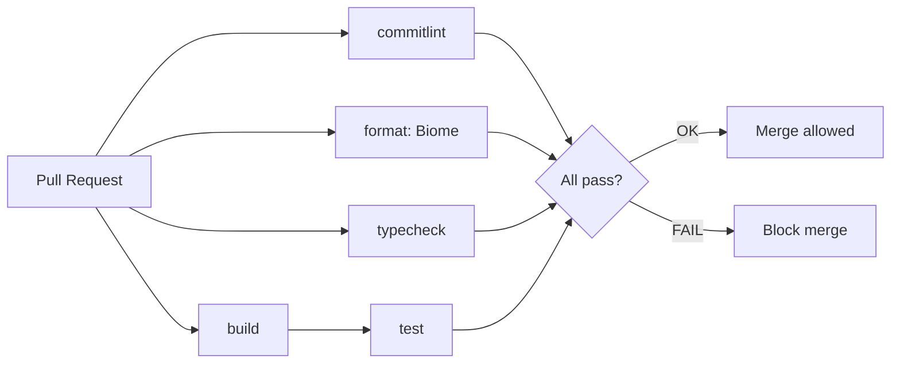
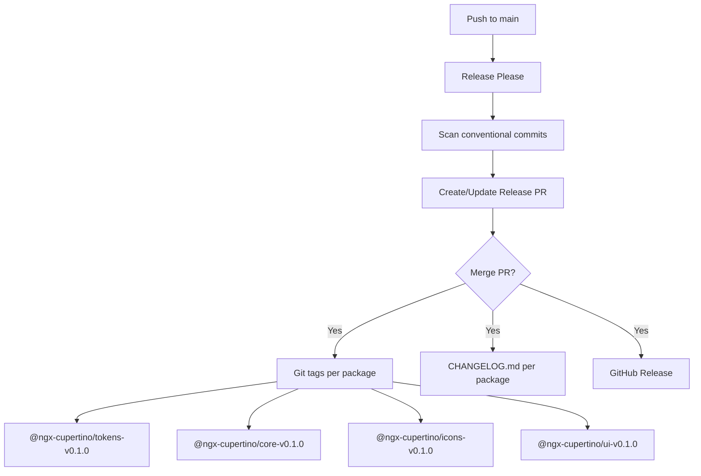
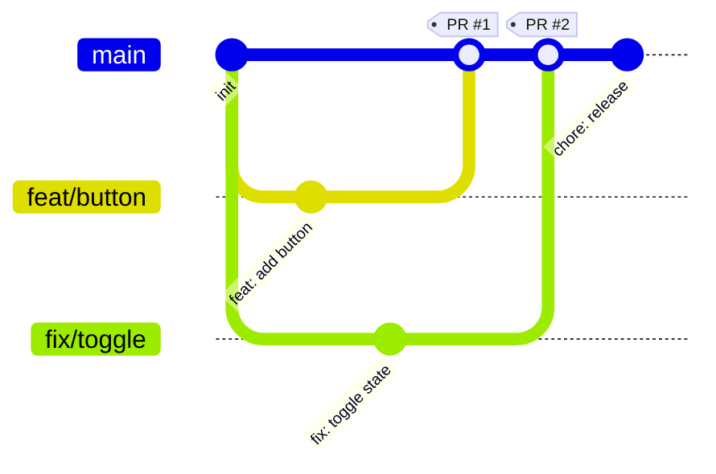

# Contributing to @ngx-cupertino/ui

## Git Workflow — GitHub Flow

> **⚠️ Every change requires its own branch. Never work directly on `main`.**

| Rule | Detail |
|---|---|
| One branch per change | Every feature, fix, or chore gets its own branch from `main` |
| No work on `main` | `main` is protected — push is rejected, commits are blocked |
| Branch from `main` | `git checkout main && git pull && git checkout -b <prefix>/<name>` |
| OpenSpec changes | Each `/opsx-propose` → new branch with matching `docs/` or `feat/` prefix |
| Component changes | Each new component → `feat/cup-<component-name>` branch |

**Example workflow:**
```bash
git checkout main
git pull
git checkout -b feat/cup-button
# ... work, commit, push ...
git push -u origin feat/cup-button
# Open PR on GitHub → CI runs → merge → delete branch
```

## Branch Naming

| Prefix     | Use case                  | Example                     |
| ---------- | ------------------------- | --------------------------- |
| `feat/`    | New component or feature  | `feat/cup-button`           |
| `fix/`     | Bug fix                   | `fix/button-disabled-state` |
| `chore/`   | Tooling, config, cleanup  | `chore/update-deps`         |
| `docs/`    | Documentation only        | `docs/contributing-guide`   |
| `refactor/`| Code restructuring        | `refactor/button-styles`    |
| `test/`    | Test additions or changes | `test/button-coverage`      |

## Commit Conventions

All commits must follow [conventional commits](https://www.conventionalcommits.org/) with emojis, enforced by Lefthook + Commitlint:

```
type(scope): emoji description

feat(ui): ✨ add Button component
fix(core): 🐛 fix ThemeService memory leak
chore(repo): 🚧 update dependencies
ci: 🔧 add release workflow
docs: 📝 update README
```

| Type       | Emoji | Semver | Description              |
| ---------- | ----- | ------ | ------------------------ |
| `feat`     | ✨    | MINOR  | New component or feature |
| `fix`      | 🐛   | PATCH  | Bug fix                  |
| `perf`     | 🚀   | PATCH  | Performance improvement  |
| `refactor` | 📦   | PATCH  | Code restructuring       |
| `test`     | 🧪   | —      | Test additions/changes   |
| `docs`     | 📝   | —      | Documentation only       |
| `ci`       | 🔧   | —      | CI/CD configuration      |
| `chore`    | 🚧   | —      | Maintenance, tooling     |
| `style`    | 💄   | —      | Formatting, styling      |
| `build`    | 🏗️   | —      | Build system changes     |

**Allowed scopes:** `tokens`, `core`, `icons`, `ui`, `playground`, `readme`, `ci`, `repo`

## Pull Request Process

1. Push your branch and [open a Pull Request](https://github.com/gacc94/ngx-cupertino/compare)
2. Fill the PR description with what changed and why
3. CI checks must all pass (commitlint, format, typecheck, build, test)
4. Request review if applicable
5. **Squash and merge** to `main` for a linear history

## CI/CD Pipeline

### CI Pipeline Flow


### Release Pipeline Flow


### Git Workflow


## Development Setup

```bash
git clone https://github.com/gacc94/ngx-cupertino.git
cd ngx-cupertino

bun install

# Serve the playground app
bun nx serve playground

# Build all projects
bun nx run-many -t build

# Run tests
bun nx test ui

# Format and lint
bun biome check --write .
```

## Project Structure

```
ngx-cupertino/
├── apps/
│   └── playground/                # Angular dev app (SCSS, cup prefix)
├── libs/
│   ├── tokens/                    # @ngx-cupertino/tokens — design tokens
│   ├── core/                      # @ngx-cupertino/core — providers, services, directives
│   ├── icons/                     # @ngx-cupertino/icons — Lucide wrapper
│   └── ui/                        # @ngx-cupertino/ui — 37 components
├── openspec/                      # Spec-driven development artifacts
├── .github/
│   └── workflows/                 # CI/CD (ci.yml, release.yml)
├── nx.json                        # Nx workspace configuration
├── tsconfig.base.json             # TypeScript base config (strict, ES2022, bundler)
├── biome.json                     # Biome formatter/linter config
├── lefthook.yml                   # Git hooks (pre-commit + commit-msg)
├── commitlint.config.ts           # Commit message validation
├── release-please-config.json     # Release Please monorepo manifest
├── CONTRIBUTING.md                # This file
├── README.md                      # Project documentation
└── LICENSE                        # MIT License
```

## Package Architecture

Four publishable packages under `@ngx-cupertino`, following the [Angular Material model](https://material.angular.dev/guide/getting-started):

```
npm registry
├── @ngx-cupertino/tokens@0.1.0    ← CSS custom properties (standalone)
├── @ngx-cupertino/core@0.1.0      ← Providers + services (depends on tokens)
├── @ngx-cupertino/icons@0.1.0     ← Lucide wrapper (depends on tokens)
└── @ngx-cupertino/ui@0.1.0        ← 37 components (peerDeps: tokens, core, icons)
```

| Angular Material        | @ngx-cupertino           | Standalone?                             |
| ----------------------- | ------------------------ | --------------------------------------- |
| `@angular/material`     | `@ngx-cupertino/ui`      | No (needs CDK)                          |
| `@angular/cdk`          | `@ngx-cupertino/core`    | ✅ `bun add @ngx-cupertino/core`        |
| `@angular/material/core`| `@ngx-cupertino/icons`   | ✅                                      |
| Prebuilt themes         | `@ngx-cupertino/tokens`  | ✅ `bun add @ngx-cupertino/tokens`      |

Each package is versioned independently. Only the package with changes gets a version bump. Consumers should install the packages required by the public API they use.

## Protected Branches

`main` is protected. All changes require Pull Request with passing CI.

### Setup Guide

1. Go to [GitHub Settings](https://github.com/gacc94/ngx-cupertino/settings)
2. Sidebar → **Rules** → **Rulesets**
3. Click **New ruleset** → **New branch ruleset**
4. Configure:

| Field | Value |
|---|---|
| Ruleset Name | `protect-main` |
| Enforcement status | **Active** |
| Target branches | **Include default branch** |
| Restrict deletions | ✅ |
| Require a pull request before merging | ✅ |
| Required approvals | `0` |
| Allow auto-merge | ✅ |
| Require status checks to pass | ✅ |
| Add checks | `commitlint`, `format`, `typecheck`, `build`, `test` |
| Block force pushes | ✅ |

**Bypass list:** Leave empty — nobody bypasses, not even repository admin.

### Merge Options

| Option | What happens | Best for |
|---|---|---|
| A — Manual | You click "Merge" when ready | Now (setup phase) |
| B — Auto-merge | GitHub merges automatically on CI green | Later (frequent component PRs) |

**Recommendation:** Start with manual merge. Enable auto-merge later when Steps 7-10 generate frequent component PRs.

## Questions?

Open an [issue](https://github.com/gacc94/ngx-cupertino/issues) or start a [discussion](https://github.com/gacc94/ngx-cupertino/discussions).
