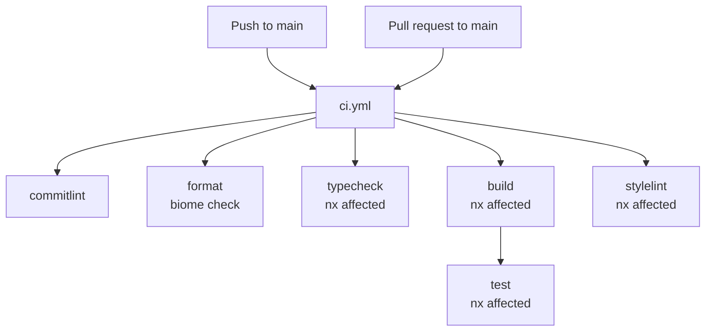

# CI Flow

How the CI pipeline (`ci.yml`) validates every push to main and pull request.

5 jobs run in parallel. Only `test` depends on `build`. All jobs use `Nx affected` for incremental runs.

## Flowchart

## Job Dependencies

| Job | Depends On | Runs |
|-----|-----------|------|
| `commitlint` | none | Parallel |
| `format` | none | Parallel |
| `typecheck` | none | Parallel |
| `build` | none | Parallel |
| `stylelint` | none | Parallel |
| `test` | build | After build completes |

## Common Configuration

All jobs use:
- `bun install --frozen-lockfile` for deterministic dependencies
- `nrwl/nx-set-shas@v5` (except commitlint) for Nx affected detection
- `bun nx affected -t <target>` (typecheck, build, stylelint, test) for incremental runs
