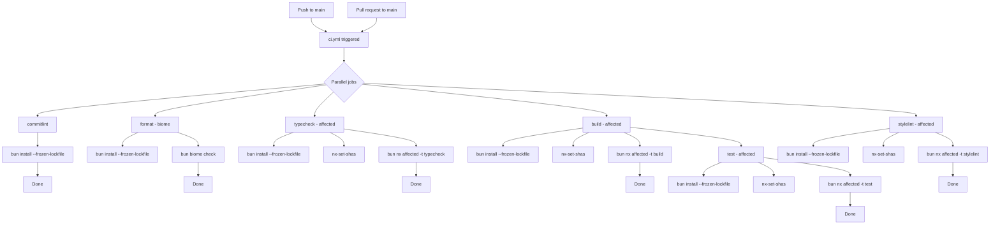

# CI Flow

How the CI pipeline (`ci.yml`) validates every push to main and pull request.

## Flowchart

## Job Dependencies

| Job | Depends On | Runs |
|-----|-----------|------|
| `commitlint` | none | Parallel |
| `format` | none | Parallel |
| `typecheck` | none | Parallel |
| `build` | none | Parallel |
| `stylelint` | none | Parallel |
| `test` | build | After build completes |

## Common Steps

All 6 jobs use:
- `bun install --frozen-lockfile` — deterministic dependency install
- `nrwl/nx-set-shas@v5` (except commitlint) — Nx affected detection based on git SHAs
- `bun nx affected -t <target>` (typecheck, build, stylelint, test) — only runs on changed projects
