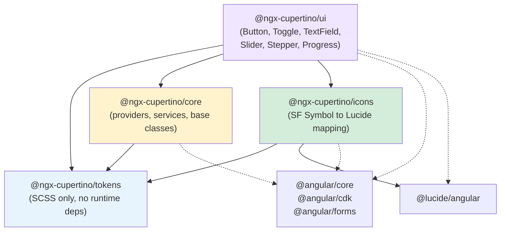
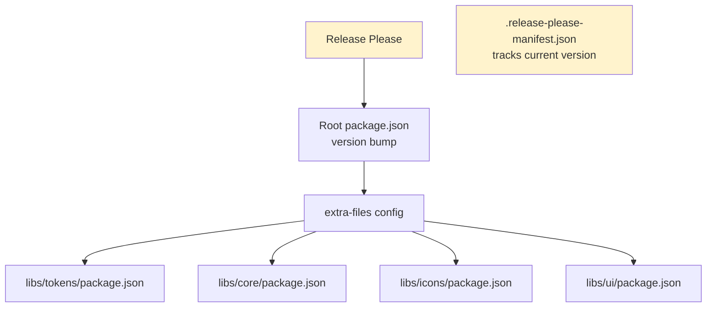

# Dependency Graph

How the 4 packages depend on each other and external dependencies.

## Internal Dependencies



Solid lines = `peerDependencies` on `@ngx-cupertino/*` packages.
Dotted lines = `peerDependencies` on external packages.

## Publish Order

Derived from the dependency graph — each package depends on all previously published packages:

```
1. @ngx-cupertino/tokens   (no @ngx-cupertino deps)
2. @ngx-cupertino/core     (depends on tokens)
3. @ngx-cupertino/icons    (depends on tokens + @lucide/angular)
4. @ngx-cupertino/ui       (depends on tokens + core + icons)
```

`core` and `icons` are independent of each other, but both come after `tokens`. `ui` always goes last.

## Monorepo Version Flow



Release Please bumps the root `package.json` version, then `extra-files` syncs that version to all 4 lib package.json files. The manifest tracks the current released version for next bump calculation.
