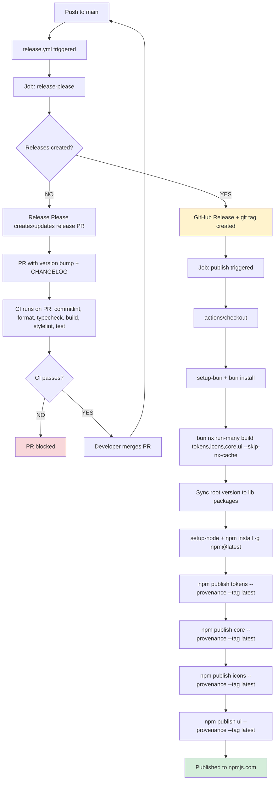
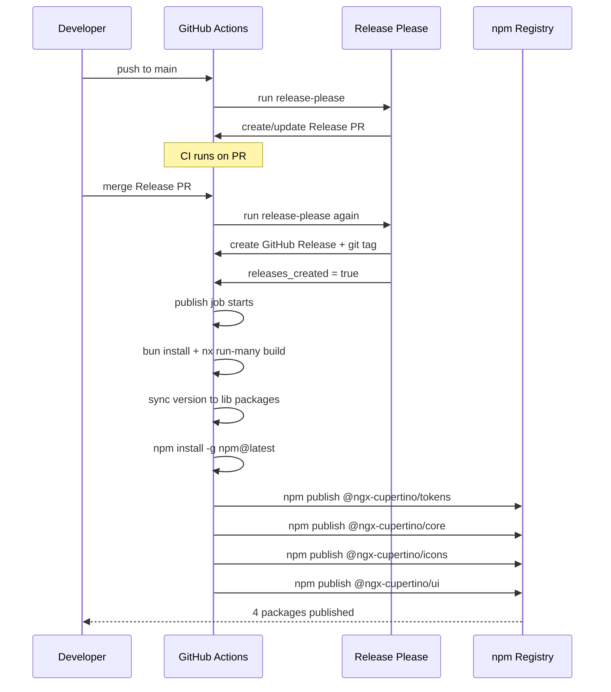

# Release Flow

How the release pipeline (`release.yml`) automates npm publishing via Release Please and Trusted Publishing (OIDC).

## Flowchart

```mermaid
flowchart TD
    A[Push to main] --> B[release.yml triggered]
    B --> C[Job: release-please]

    C --> D{Releases created?}
    D -->|NO| E[Release Please creates/updates release PR]
    E --> F[PR with version bump + CHANGELOG]
    F --> G[CI runs on PR: commitlint, format, typecheck, build, stylelint, test]
    G --> H{CI passes?}
    H -->|NO| I[PR blocked]
    H -->|YES| J[Developer merges PR]
    J --> A

    D -->|YES| K[GitHub Release + git tag created]
    K --> L[Job: publish triggered]
    L --> M[actions/checkout]
    M --> N[setup-bun + bun install]
    N --> O[bun nx run-many build tokens,icons,core,ui --skip-nx-cache]
    O --> P[Sync root version to lib packages]
    P --> Q[setup-node + npm install -g npm@latest]
    Q --> R[npm publish tokens --provenance --tag latest]
    R --> S[npm publish core --provenance --tag latest]
    S --> T[npm publish icons --provenance --tag latest]
    T --> U[npm publish ui --provenance --tag latest]
    U --> V[Published to npmjs.com]

    style I fill:#f8d7da
    style V fill:#d4edda
    style K fill:#fff3cd
```

## Sequence Diagram

```mermaid
sequenceDiagram
    participant Dev as Developer
    participant GH as GitHub Actions
    participant RP as Release Please
    participant npm as npm Registry

    Dev->>GH: push to main
    GH->>RP: run release-please
    RP->>GH: create/update Release PR
    Note over GH: CI runs on PR
    Dev->>GH: merge Release PR
    GH->>RP: run release-please again
    RP->>GH: create GitHub Release + git tag
    RP->>GH: releases_created = true
    GH->>GH: publish job starts
    GH->>GH: bun install + nx run-many build
    GH->>GH: sync version to lib packages
    GH->>GH: npm install -g npm@latest
    GH->>npm: npm publish @ngx-cupertino/tokens
    GH->>npm: npm publish @ngx-cupertino/core
    GH->>npm: npm publish @ngx-cupertino/icons
    GH->>npm: npm publish @ngx-cupertino/ui
    npm-->>Dev: 4 packages published
```
