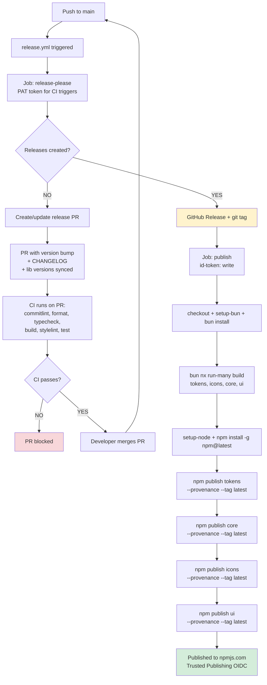
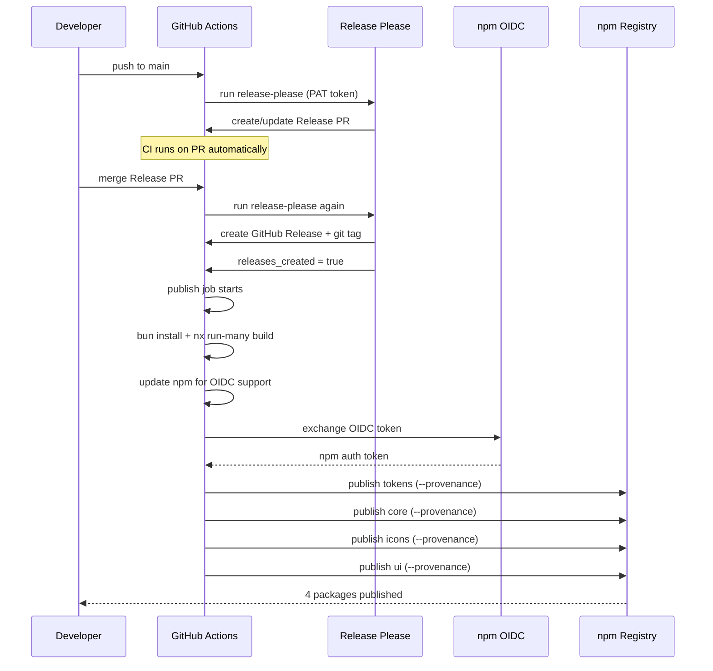

# Release Flow

How the release pipeline (`release.yml`) automates npm publishing via Release Please and Trusted Publishing (OIDC).

Release Please uses a PAT (`RELEASE_PLEASE_PAT`) so its PRs trigger CI automatically. Extra files in `release-please-config.json` sync versions to all `libs/*/package.json`.

## Flowchart

## Sequence Diagram

