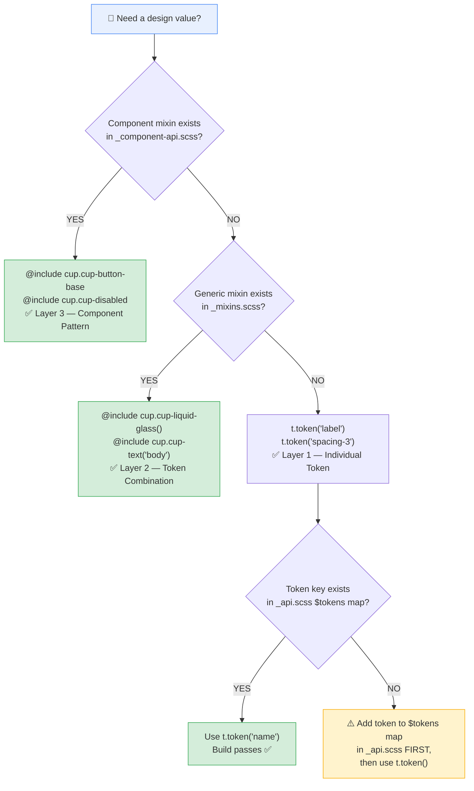

# Token Usage — Decision Flow

> **Purpose:** Every time a component needs a design value (color, spacing, radius, typography, motion, etc.), follow this decision tree. The 3-layer validation architecture ensures tokens are always correct at build time.



> **Note on naming:** CSS custom properties (`--cup-*`) and SCSS mixin names (`cup-button-base`, `cup-liquid-glass`) keep the `cup-` prefix. Only internal CSS classes within components dropped it (e.g., `.cup-label` → `.label`) — Angular's `ViewEncapsulation.Emulated` handles scoping.

## The 3-Layer Validation Architecture

| Layer | File | Package | What it validates | Build failure? |
|---|---|---|---|---|
| **3** | `_component-api.scss` | `@ngx-cupertino/core` | Complete component pattern (base + variants + sizes) | ❌ Runtime inconsistency |
| **2** | `_mixins.scss` | `@ngx-cupertino/core` | Token combinations (glass, text, disabled) | ❌ Visual bugs |
| **1** | `_api.scss` | `@ngx-cupertino/tokens` | Individual token existence (178 tokens) | ✅ SCSS `@error` |

## Examples

### ✅ Correct: Use the highest available layer

```scss
// Button — Layer 3 component mixin exists, use it
@use '@ngx-cupertino/core' as cup;
:host { @include cup.cup-button-base; }
:host(.filled) { @include cup.cup-button-variant('filled'); }
```

```scss
// Custom card — No component mixin, use Layer 2 generic mixin
@use '@ngx-cupertino/core' as cup;
.my-card { @include cup.cup-liquid-glass('regular'); }
```

```scss
// One-off spacing — No mixin, use Layer 1 token directly
@use '@ngx-cupertino/tokens' as t;
.custom-gap { margin-bottom: t.token('spacing-6'); }
```

### ❌ Wrong: Skip layers

```scss
// ❌ DON'T: Use raw var(--cup-*) when a mixin exists
:host { padding: var(--cup-spacing-3) var(--cup-spacing-5); }

// ❌ DON'T: Use t.token() when a component mixin exists
:host { @include t.token('label'); }
```

## Adding New Tokens

1. Define the `--cup-*` property in the appropriate SCSS partial (`_colors.scss`, `_spacing.scss`, etc.)
2. Add the key-value pair to `$tokens` map in `_api.scss`
3. If it's a common pattern, add a mixin to `_mixins.scss` or `_component-api.scss`
4. Use the highest available layer in your component

## Quick Reference

```
Need a button?     → @include cup.cup-button-base
Need glass?        → @include cup.cup-liquid-glass()
Need a one-off?    → t.token('name')
Token missing?     → Add to _api.scss FIRST
```
