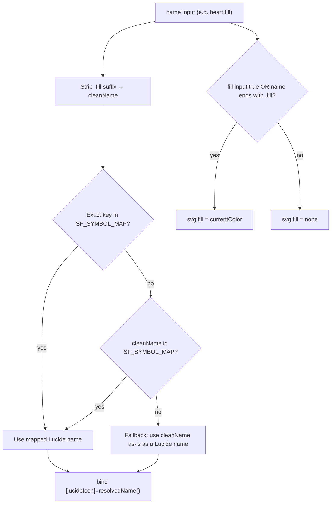

# @ngx-cupertino/icons — Architecture

Icon system that bridges Apple **SF Symbol** names to **Lucide** icons and renders them through a
signal-first `cup-icon` component, sized by the `@ngx-cupertino/tokens` Sass contract and
registered tree-shakeably via `provideCupIcons()`.

## Purpose

Apple platforms reference icons by SF Symbol names (`house`, `magnifyingglass`, `heart.fill`).
The web has no SF Symbols, so this library maps those names to the closest Lucide icon and exposes
a single component that:

- accepts SF Symbol names **and** raw Lucide names
- resolves the `.fill` suffix to a filled presentation
- sizes itself from design tokens (named `sm`/`md`/`lg` or a numeric override)
- stays accessible by default (decorative unless an `ariaLabel` is given)
- registers only the icons the app actually uses (tree-shaking friendly)

The library depends only on `@lucide/angular` and `@ngx-cupertino/tokens`. It intentionally does
**not** depend on `@ngx-cupertino/core` (see [Versioning Policy](#versioning-policy)).

## File Tree

```
libs/icons/src/
├── index.ts                  ← Public barrel (component, provider, types, maps)
└── lib/
    ├── cup-icon.ts            ← The cup-icon component (signal-first, OnPush)
    ├── cup-icon.scss          ← Host sizing from token contract
    ├── sf-symbol-map.ts       ← SF Symbol name → Lucide name (source of default set)
    ├── lucide-icon-map.ts     ← Lucide name → imported icon data (tree-shakeable)
    ├── provide-icons.ts       ← provideCupIcons() + CUP_ICON_REGISTRY token
    └── icons.spec.ts          ← Map integrity + component behavior tests
```

## Main Building Blocks

### `cup-icon` (component)

Standalone, `ChangeDetectionStrategy.OnPush`, signal-first. Imports `LucideDynamicIcon` and renders
a single `<svg lucideIcon>`.

Inputs:

| Input | Type | Default | Notes |
|-------|------|---------|-------|
| `name` | `string` (required) | — | SF Symbol or Lucide name; `.fill` suffix supported |
| `size` | `'sm' \| 'md' \| 'lg' \| number` | `'md'` | Named token size or numeric pixels |
| `strokeWidth` | `number` | `1.75` | Forwarded to Lucide |
| `fill` | `boolean` | `false` | Forces filled presentation |
| `color` | `string` | `'currentColor'` | Forwarded to Lucide |
| `ariaLabel` | `string` | — | Switches the icon from decorative to `role="img"` |

Computed state:

- `resolvedName()` — final Lucide name passed to `[lucideIcon]` (see [Resolution Pipeline](#resolution-pipeline))
- `isFilled()` — `fill()` OR `name()` ends with `.fill`
- `resolvedSize()` — numeric pixel value, or a `var(--cup-icon-size*)` string for named sizes
- `customSizeStyle()` — `"<n>px"` inline width/height when `size` is numeric, else `null`

A dev-only `effect()` warns when a resolved name maps to a known built-in icon that was **not**
registered through `provideCupIcons()` — surfacing the most common "blank icon" mistake early.

### `SF_SYMBOL_MAP`

`Record<SF name, Lucide name>` covering navigation, actions, status, media, files, connectivity,
weather, and more. Includes explicit `.fill` keys (`heart.fill`, `house.fill`, …). The unique set
of its **values** is the default icon set registered by `provideCupIcons()`.

`CupSfSymbolName` is derived from its keys.

### `LUCIDE_ICONS`

`Record<Lucide name, LucideIconData>` built from named imports (`LucideHouse`, `LucideStar`, …).
Importing icons explicitly keeps the bundle tree-shakeable: only what's referenced ships.

`CupBuiltInIconName` is derived from its keys and is the type accepted by `provideCupIcons({ names })`.

### `provideCupIcons()` + `CUP_ICON_REGISTRY`

`provideCupIcons()` returns the Lucide providers plus a `CUP_ICON_REGISTRY` (`ReadonlySet<string>`)
holding the registered names. With no options it registers the full default set; with `{ names }`
it registers a subset for bundle-size-sensitive apps. Unknown names are skipped with a dev warning.
`cup-icon` reads the registry (optional inject) only to power its dev-time registration warning.

## Resolution Pipeline



`resolvedName()` tries the raw name first (so `heart.fill` could be mapped directly if a key exists),
then the `.fill`-stripped name, then falls back to the cleaned name as a literal Lucide name. This is
why raw Lucide names (`search`, `sparkles`) work as long as they are registered.

## Registration Model

`cup-icon` does **not** self-register icons. Registration is explicit and centralized:

- Default: `provideCupIcons()` → every distinct value in `SF_SYMBOL_MAP`.
- Subset: `provideCupIcons({ names: ['star', 'heart', 'search'] })` → only those, smaller bundle.
- Manual: any name registered through Lucide's own `provideLucideIcons()` also resolves.

In dev mode, if a `cup-icon` resolves to a known built-in icon that was not registered, it logs a
one-time warning naming the input, the resolved name, and how to fix it. In production the check is
compiled out (`ngDevMode` guard).

## Sizing Contract

Sizes come from `@ngx-cupertino/tokens`: `--cup-icon-size` (md), `--cup-icon-size-sm`, `--cup-icon-size-lg`.

- **Named sizes** (`sm`/`md`/`lg`): the host element is dimensioned by `cup-icon.scss` through host
  classes (`.cup-small`, `.cup-large`) that read the token contract via `t.token(...)`.
- **Numeric size**: `customSizeStyle()` writes inline `width`/`height` in pixels on the host, and the
  numeric value is forwarded to Lucide's `[size]`.

> Note: the named-size path currently also forwards a `var(--cup-icon-size*)` string to Lucide's
> `[size]`, which duplicates the host sizing. Consolidating to a single source of truth (host sizes,
> `svg { width:100%; height:100% }`) is tracked in the icons audit (A2/A3).

## Accessibility

- No `ariaLabel` → host gets `aria-hidden="true"` and no `role` (decorative; ignored by screen readers).
- `ariaLabel` provided → host gets `role="img"` and the label; the icon is announced as an image.

This keeps purely decorative icons silent while letting meaningful icons carry an accessible name.

## `.fill` Semantics

Lucide is an outline icon set; it has no native filled variants. `cup-icon` simulates fill by setting
`fill="currentColor"` on the outline path. This reads well for solid shapes (`heart`, `star`,
`bookmark`, circles) but can look heavy on icons with internal cutouts (`bell`, `house`, `folder`),
where filling the whole path hides interior detail. Treat `.fill` as an approximation, not a
pixel-faithful Apple filled symbol.

## Versioning Policy

Baseline: **Angular `>=18`**. The component relies on **signal inputs** (`input()`/`input.required()`),
which became stable in v18; the remaining APIs (`signal`, `computed`, `effect`, `booleanAttribute`,
`numberAttribute`) are older. The template uses no v17+ control flow.

- `@lucide/angular` is supported at `>=1.17.0` (its peer range covers Angular 17–21).
- The library does **not** peer-depend on `@ngx-cupertino/core` (which requires Angular `>=21`), so
  `icons` can be consumed standalone on Angular 18+. As a consequence, `CupIconSize` is a deliberate
  local mirror of `core`'s `CupComponentSize` — the trivial `"sm" | "md" | "lg"` union is duplicated
  rather than imported, to avoid coupling `icons` to `core`'s version floor. Keep both in sync.

## Extensibility

To add a new symbol:

1. Add the SF name → Lucide name entry in `SF_SYMBOL_MAP` (and a `.fill` key if relevant).
2. Import the Lucide icon and add it to `LUCIDE_ICONS` under its Lucide name.
3. Add/extend a test in `icons.spec.ts` (every `SF_SYMBOL_MAP` value must exist in `LUCIDE_ICONS`).

For a base/`.fill` pair, keep both entries pointing at the **same geometry** — the fill is applied by
the component, it must not change the icon's shape.

## Public API

Exported from `@ngx-cupertino/icons`:

- `CupIcon` — the component
- `CupIconSize` — `'sm' | 'md' | 'lg'` (mirrors the design-system component size)
- `provideCupIcons`, `ProvideCupIconsOptions` — registration
- `CupBuiltInIconName` — valid built-in Lucide names for `{ names }`
- `SF_SYMBOL_MAP`, `CupSfSymbolName` — the SF→Lucide map and its key union
