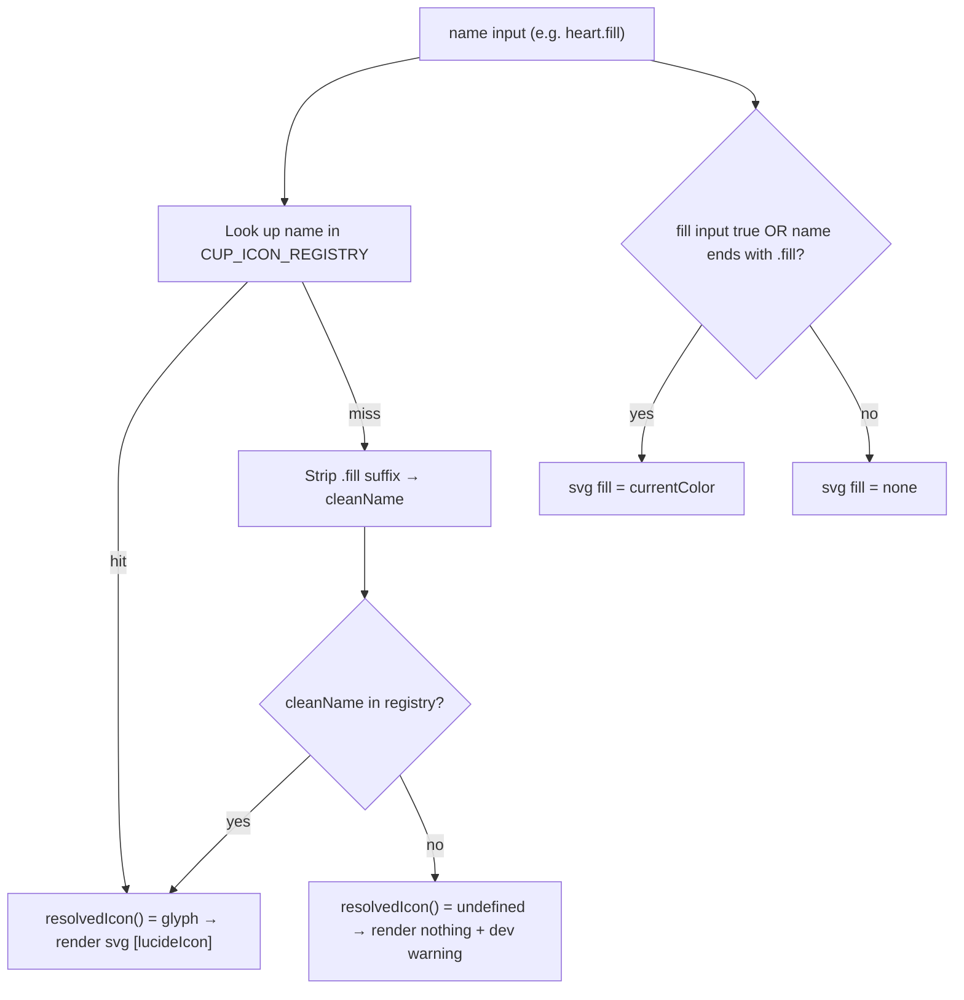

# @ngx-cupertino/icons — Architecture

Icon system that bridges Apple **SF Symbol** names to **Lucide** glyphs and renders them through a
signal-first `cup-icon` component, sized by the `@ngx-cupertino/tokens` Sass contract and registered
on demand via `provideCupIcons()`.

## Purpose

Apple platforms reference icons by SF Symbol names (`house`, `magnifyingglass`, `heart.fill`).
The web has no SF Symbols, so this library maps those names to the closest Lucide glyph and exposes
a single component that:

- accepts SF Symbol names **and** raw Lucide names
- resolves the `.fill` suffix to a filled presentation
- sizes itself from design tokens (named `sm`/`md`/`lg` or a numeric override)
- stays accessible by default (decorative unless an `ariaLabel` is given)
- registers only the icons the app actually uses (tree-shaking friendly)

The library depends only on `@lucide/angular` and `@ngx-cupertino/tokens`. It intentionally does
**not** depend on `@ngx-cupertino/core` (see [Versioning Policy](#versioning-policy)).

## File Tree

```
libs/icons/src/
├── index.ts                  ← Public barrel (component, provider, icon defs, types)
└── lib/
    ├── cup-icon.ts            ← The cup-icon component (signal-first, OnPush)
    ├── cup-icon.scss          ← Host sizing from token contract
    ├── provide-icons.ts       ← provideCupIcons() + CUP_ICON_REGISTRY token
    ├── icon-set.ts            ← Barrel: re-exports every icon def + assembles ALL_ICONS + name types
    ├── icons/                 ← Icon defs split by category (each a standalone named export)
    │   ├── types.ts           ← CupIconDef interface
    │   ├── navigation.ts      ← houseIcon, bellIcon, … + NAVIGATION_ICONS group
    │   ├── arrows.ts          ← chevron*/arrow* + ARROW_ICONS group
    │   ├── actions.ts  status.ts  weather.ts  time.ts  communication.ts
    │   ├── media.ts    files.ts   commerce.ts people.ts transport.ts
    │   └── devices.ts  objects.ts
    └── icons.spec.ts          ← Icon-set integrity + component behavior tests
```

## Main Building Blocks

### Icon definitions (`icons/*.ts`)

Each icon is a standalone named export — an SF Symbol `name` paired with its Lucide glyph:

```ts
export const houseIcon = { name: "house", icon: LucideHouse } as const satisfies CupIconDef;
export const houseFillIcon = { name: "house.fill", icon: LucideHouse } as const satisfies CupIconDef;
```

`CupIconDef` is `{ readonly name: string; readonly icon: LucideIcon }`. Defs live in category files
(`navigation.ts`, `media.ts`, …); each file also exports a **group array** of its own defs
(`NAVIGATION_ICONS`, `MEDIA_ICONS`, …) so its members are added in exactly one place, contiguous with
their definitions.

Standalone named exports are what make the set tree-shakeable: an app imports `houseIcon` directly,
so only the icons it references ship — there is **no central map** that pulls every icon in.

### `icon-set.ts` (barrel)

Re-exports every icon and every group, then assembles `ALL_ICONS` and the name types:

- `ALL_ICONS` — every built-in def, for **tooling/galleries only** (Storybook, tests). See
  [Bundle Size & Tree-Shaking](#bundle-size--tree-shaking) for why it is built with a pure `.concat`,
  not array spread.
- `CupSfSymbolName` — the literal union of every built-in name, derived from the **group tuples'**
  element types (type-only, zero runtime cost).
- `CupIconName` — `CupSfSymbolName | (string & {})`: autocompletes built-in names while still
  accepting any other string (a raw Lucide name or a manually registered icon).

### `cup-icon` (component)

Standalone, `ChangeDetectionStrategy.OnPush`, signal-first. Imports `LucideDynamicIcon` and renders a
single `<svg [lucideIcon]>` — but only when the name resolves.

Inputs:

| Input | Type | Default | Notes |
|-------|------|---------|-------|
| `name` | `CupIconName` (required) | — | SF Symbol or Lucide name; `.fill` suffix supported |
| `size` | `'sm' \| 'md' \| 'lg' \| number` | `'md'` | Named token size or numeric pixels |
| `strokeWidth` | `number` | `1.75` | Forwarded to Lucide |
| `fill` | `boolean` | `false` | Forces filled presentation |
| `color` | `string` | `'currentColor'` | Forwarded to Lucide |
| `ariaLabel` | `string` | — | Switches the icon from decorative to `role="img"` |

Computed state:

- `resolvedIcon()` — the `LucideIcon` glyph looked up from the registry (the `.fill` suffix is
  stripped first), or `undefined` if not registered. The SVG renders only when this is defined.
- `isFilled()` — `fill()` OR `name()` ends with `.fill`
- `resolvedSize()` — numeric pixel value forwarded to Lucide's `[size]`, or `undefined` for named sizes
- `customSizeStyle()` — `"<n>px"` inline width/height when `size` is numeric, else `null`

A dev-only `effect()` warns once when a `name` is not registered (so it cannot render) — surfacing
the most common "blank icon" mistake early. Compiled out in production via the `ngDevMode` guard.

### `provideCupIcons()` + `CUP_ICON_REGISTRY`

```ts
export const CUP_ICON_REGISTRY = new InjectionToken<ReadonlyMap<string, LucideIcon>>(…);

export function provideCupIcons(...defs: readonly CupIconDef[]): Provider[];
```

`provideCupIcons(...defs)` is **variadic**: pass the icon defs you imported. It builds a
`Map<name, glyph>` and provides it as `CUP_ICON_REGISTRY`. `cup-icon` injects the registry and
resolves the glyph directly from it — Lucide's `[lucideIcon]` receives the glyph **data**, never a
global name→glyph map, so nothing forces the whole set into the bundle.

## Resolution Pipeline


```mermaid
flowchart TD
    A["name input (e.g. heart.fill)"] --> B[Look up name in CUP_ICON_REGISTRY]
    B -- hit --> G["resolvedIcon() = glyph → render svg [lucideIcon]"]
    B -- miss --> C[Strip .fill suffix → cleanName]
    C --> D{cleanName in registry?}
    D -- yes --> G
    D -- no --> E["resolvedIcon() = undefined → render nothing + dev warning"]
    A --> H{fill input true OR name ends with .fill?}
    H -- yes --> I["svg fill = currentColor"]
    H -- no --> J["svg fill = none"]
```

`resolvedIcon()` tries the raw name first (so an explicitly registered `heart.fill` wins), then the
`.fill`-stripped name. A name that resolves to neither renders nothing and logs a one-time dev
warning — it never throws.

## Registration Model

`cup-icon` does **not** self-register icons. Registration is explicit:

```ts
import { provideCupIcons, starIcon, heartFillIcon, magnifyingglassIcon } from "@ngx-cupertino/icons";

providers: [provideCupIcons(starIcon, heartFillIcon, magnifyingglassIcon)];
```

- **Per-icon** (recommended): import the defs you use and pass them. Smallest bundle.
- **Everything** (tooling/prototyping): `provideCupIcons(...ALL_ICONS)`. Do not ship to production.

`cup-icon` resolves glyphs **only** from `CUP_ICON_REGISTRY`. It does not require — and does not read —
Lucide's own name registry (`provideIcons` / `LucideAngularModule.pick`): `LucideDynamicIcon` is given
the glyph **data** directly via `[lucideIcon]`, and `LUCIDE_CONFIG` supplies its own default. So no
`@lucide/angular` provider is needed; `provideCupIcons(...)` is the only registration.

## Bundle Size & Tree-Shaking

Two layers contribute to bundle size; they tree-shake differently.

**1. This library's defs — tree-shakeable.** Icons are standalone named exports and the package is
`"sideEffects": false`, so an app that imports `houseIcon` ships only `houseIcon`. The one trap is
`ALL_ICONS`: it must stay **pure** so a bundler can drop it when an app never imports it. Array
spread (`[...GROUP, ...]`) is an iterator call that bundlers treat as a side effect — that kept
`ALL_ICONS` (and every icon it references) in the bundle even when unused. It is therefore assembled
with a `/*@__PURE__*/`-annotated `.concat`:

```ts
export const ALL_ICONS: readonly CupIconDef[] = /*@__PURE__*/ (NAVIGATION_ICONS as readonly CupIconDef[]).concat(
    ARROW_ICONS, ACTION_ICONS, /* … */,
);
```

Verified with esbuild: an app importing a single icon DCEs the other defs away. Never change this
back to spread, and never import `ALL_ICONS` from app code.

**2. The underlying Lucide glyphs — limited by `@lucide/angular`.** `@lucide/angular@1.x` ships a
single barrel entry point (`fesm2022/lucide-angular.mjs`, ~5 MB) with **no per-icon subpaths**.
Importing any glyph (`import { LucideHouse } from "@lucide/angular"`) pulls a large slice of that
barrel — measured at ~2 MB in a raw esbuild bundle — regardless of this library. This is an upstream
packaging limitation that affects every Lucide consumer.

**Decision (accepted):** we keep Lucide as the glyph source and live with its barrel cost. Our layer
is on-demand; Lucide's barrel is not finely tree-shakeable today. Real Angular CLI production builds
trim it somewhat (the package is `sideEffects:false`), but the barrel remains the dominant cost. If
this becomes a problem, the options are: bring SVG geometry in-house (lose the Lucide source), or
push upstream for per-icon subpath exports.

## Sizing Contract

Sizes come from `@ngx-cupertino/tokens`: `--cup-icon-size` (md), `--cup-icon-size-sm`, `--cup-icon-size-lg`.

- **Named sizes** (`sm`/`md`/`lg`): the host element is dimensioned by `cup-icon.scss` through host
  classes (`.cup-small`, `.cup-large`) that read the token contract; the SVG fills the host. Single
  source of truth — the numeric `[size]` is **not** forwarded for named sizes (`resolvedSize()` is
  `undefined`).
- **Numeric size**: `customSizeStyle()` writes inline `width`/`height` in pixels on the host, and the
  numeric value is forwarded to Lucide's `[size]`.

## Accessibility

- No `ariaLabel` → host gets `aria-hidden="true"` and no `role` (decorative; ignored by screen readers).
- `ariaLabel` provided → host gets `role="img"` and the label; the icon is announced as an image.

This keeps purely decorative icons silent while letting meaningful icons carry an accessible name.

## `.fill` Semantics

Lucide is an outline icon set; it has no native filled variants. `cup-icon` simulates fill by setting
`fill="currentColor"` on the outline path. This reads well for solid shapes (`heart`, `star`,
`bookmark`, circles) but can look heavy on icons with internal cutouts (`bell`, `house`, `folder`),
where filling the whole path hides interior detail. Treat `.fill` as an approximation, not a
pixel-faithful Apple filled symbol. Only glyphs whose SF Symbol has a genuine fill (and that read
well solid) ship a `.fill` variant; stroke-based glyphs (`chevron`, `arrow`, `magnifyingglass`) do not.

## Versioning Policy

Baseline: **Angular `>=18`**. The component relies on **signal inputs** (`input()`/`input.required()`),
which became stable in v18; the remaining APIs (`signal`, `computed`, `effect`, `booleanAttribute`,
`numberAttribute`) are older. The template uses `@if` control flow (v17+).

- `@lucide/angular` is supported at `>=1.17.0` (its peer range covers Angular 17–21).
- The library does **not** peer-depend on `@ngx-cupertino/core` (which requires Angular `>=21`), so
  `icons` can be consumed standalone on Angular 18+. As a consequence, `CupIconSize` is a deliberate
  local mirror of `core`'s `CupComponentSize` — the trivial `"sm" | "md" | "lg"` union is duplicated
  rather than imported, to avoid coupling `icons` to `core`'s version floor. Keep both in sync.

## Extensibility

To add a new symbol:

1. Pick the right category file in `icons/` (or add a new one). Add the named export and include it in
   that file's group array:
   ```ts
   export const flagIcon = { name: "flag", icon: LucideFlag } as const satisfies CupIconDef;
   // …
   export const OBJECT_ICONS = [/* … */, flagIcon] as const;
   ```
2. If you added a new category file, wire its `export *` and group spread into `icon-set.ts`
   (the `export *` list, the `import { GROUP }` list, and the `AnyIconDef` union).
3. Add/extend a test in `icons.spec.ts`. A base/`.fill` pair must point at the **same geometry** — the
   fill is applied by the component, it must not change the icon's shape.

## Public API

Exported from `@ngx-cupertino/icons`:

- `CupIcon` — the component
- `CupIconSize` — `'sm' | 'md' | 'lg'` (mirrors the design-system component size)
- `provideCupIcons`, `CUP_ICON_REGISTRY` — registration
- Individual icon defs — `houseIcon`, `starFillIcon`, … (import only what you use)
- `ALL_ICONS` — every built-in def (tooling/galleries only)
- `CupIconDef` — the icon-def shape
- `CupIconName`, `CupSfSymbolName` — the name autocomplete types
