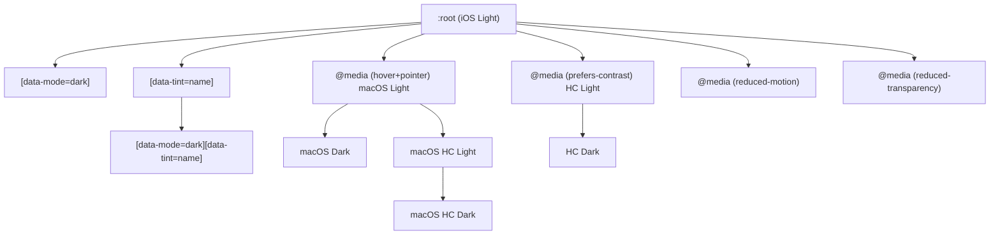
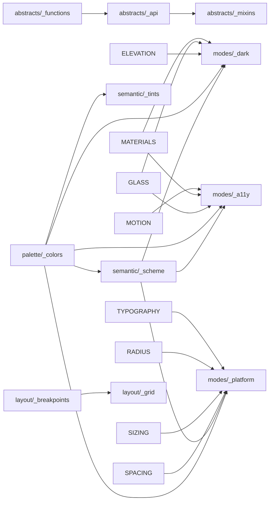

# @ngx-cupertino/tokens — Architecture

Design token system implementing the Apple Design System (iOS 26, iPadOS 26, macOS Tahoe 26) for web.

## File Tree

Partials are grouped into layer folders. Each folder owns an `_index.scss`
that `@forward`s its partials; the root `_index.scss` forwards the folders in
cascade order (see [Cascade Order](#cascade-order)).

```
libs/tokens/src/lib/
├── _index.scss                  ← Root manifest (forwards layers in cascade order)
│
├── abstracts/                   Tooling — emits CSS only for the z-index scale
│   ├── _index.scss
│   ├── _functions.scss           3 funcs  ← cup-rem, cup-space, cup-z
│   ├── _api.scss                ~236 map  ← Token validator + token()
│   ├── _mixins.scss              21 mixins ← Reusable patterns
│   └── _z-index.scss             8 tokens ← Stacking order
│
├── palette/                     Base light color source of truth
│   ├── _index.scss
│   └── _colors.scss             18 tokens ← 12 accents + 6 grays
│
├── semantic/                    Role-based + accent tokens
│   ├── _index.scss
│   ├── _scheme.scss             28 tokens ← Labels, fills, bgs, separators
│   └── _tints.scss            4×13 preset ← Active accent [data-tint]
│
├── visual/                      Non-color rendering primitives
│   ├── _index.scss
│   ├── _borders.scss            11 tokens ← Widths, colors, styles
│   ├── _radius.scss             26 tokens ← Radius scale + semantic
│   ├── _elevation.scss           5 tokens ← Box shadows
│   ├── _glass.scss              17 tokens ← Liquid Glass (regular+clear)
│   ├── _materials.scss          12 tokens ← System blur materials
│   └── _opacity.scss             9 tokens ← States + overlays
│
├── layout/                      Spatial tokens (grid consumes breakpoints)
│   ├── _index.scss
│   ├── _spacing.scss            21 tokens ← 4px grid + semantic gaps
│   ├── _sizing.scss             27 tokens ← Targets, heights, dimensions
│   ├── _breakpoints.scss      3 vars+6 mix ← Responsive queries
│   ├── _grid.scss                6 tokens ← Columns, gutters, max-widths
│   └── _safe-areas.scss          7 tokens ← Device insets
│
├── typography/
│   ├── _index.scss
│   └── _typography.scss         27 tokens ← Fonts, type scale, weights
│
├── motion/
│   ├── _index.scss
│   └── _motion.scss             10 tokens ← Durations + easing
│
└── modes/                       Conditional override layers — forwarded LAST
    ├── _index.scss
    ├── _dark.scss              ~72 ovr    ← [data-mode="dark"]
    ├── _platform.scss         ~147 ovr    ← macOS (hover+pointer)
    └── _a11y.scss             ~115 ovr    ← HC, motion, transparency
```

## 5-Layer Architecture

| Layer             | Files | Tokens          | What It Does                                          |
| ----------------- | ----- | --------------- | ----------------------------------------------------- |
| **1. Primitives** | 7     | ~139            | Raw values. "Here is red. Here is 16px."              |
| **2. Semantic**   | 7     | ~84 + tints     | Contextual meaning. "This is a label. This is glass." |
| **3. Overrides**  | 3     | 0 new, ~334 ovr | Dark mode, macOS, accessibility overrides             |
| **4. Layout**     | 3     | ~13 + 6 mix     | Responsive structure, grid, safe areas                |
| **5. Utilities**  | 3     | 0 tokens        | API: token(), mixins, functions — zero CSS output     |

## Cascade Order

The root `lib/_index.scss` forwards layer folders in this order:
`abstracts → palette → semantic → typography → layout → visual → motion → modes`.
The `modes/` folder is forwarded **last** on purpose: its `[data-mode="dark"]`,
`@media (prefers-contrast: more)`, and `@media (hover: hover)` blocks override
palette and semantic tokens at equal selector specificity, so they must emit
after the base values. Later files override earlier files.



## File Dependencies



## How Components Consume Tokens (3-Layer SCSS Pattern)

```scss
@use "@ngx-cupertino/tokens" as t;

// Layer 1 — token() for single values
:host {
    min-height: t.token("control-height");
    padding: t.token("padding-button");
    border-radius: t.token("radius-button");
    font-size: t.token("text-body");
}

// Layer 2 — mixins for multi-property patterns
:host {
    @include t.cup-interactive;
    @include t.cup-focus-ring;
}
:host(.filled) {
    background: t.token("tint");
    color: t.token("tint-on");
}
:host(.cup-disabled) {
    @include t.cup-disabled;
}
```

Components NEVER write raw `var(--cup-*)`. They always use `t.token('name')` for compile-time validation.

## Maintenance Rules

| Action                        | Update Required                                                                                        |
| ----------------------------- | ------------------------------------------------------------------------------------------------------ |
| Add new `--cup-*` token       | Add the name string to the correct section of `$all` in `abstracts/_tokens.scss`                       |
| Rename a token                | Update the name string in `$all`. All `t.token('old-name')` call sites fail to compile immediately.    |
| Remove a token                | Remove the name string from `$all`. All call sites referencing it fail to compile immediately.         |
| Add token with non-standard suffix | Add an entry to `$aliases` in `_tokens.scss`: `'key': var(--cup-different-suffix)`               |
| Change a token's VALUE        | No `abstracts/_tokens.scss` change needed — values live in the owning partial (palette, semantic, etc) |
| Add dark/platform/HC override | No `_tokens.scss` change needed                                                                        |
| Add macOS-exclusive token     | Add the name string to the `// platform` section of `$all` in `abstracts/_tokens.scss`                |
| **Add a new partial file**    | Add a `"./partial-name": { "sass": "./src/lib/path/_file.scss" }` entry to `package.json` `exports`   |

### `package.json` exports obligation

Every new SCSS partial that consumers may `@use` directly **must** be declared in `package.json` under `exports`. Omitting the entry causes resolution failures when the package is consumed via `node_modules` (the `sass` field is ignored without an explicit export).

```json
// package.json → exports
"./new-partial": {
    "sass": "./src/lib/category/_new-partial.scss"
}
```

The `_index.scss` entry (exported as `"."`) covers consumers who `@use '@ngx-cupertino/tokens'`. Individual partials need explicit entries only when consumers use deep imports like `@use '@ngx-cupertino/tokens/glass'`.

## Token Registry Architecture

The registry is split across two files in `abstracts/`:

| File | Responsibility | Emits CSS? |
| ---- | -------------- | ---------- |
| `abstracts/_tokens.scss` | Data — `$all` list of valid names + `$aliases` map for exceptions | No |
| `abstracts/_api.scss` | Logic — `token()` function only | No |

`_tokens.scss` is a private module: it is `@use`d by `_api.scss` but is **not** `@forward`ed from `abstracts/_index.scss`. Consumers cannot access `$all` or `$aliases` directly — only `t.token('name')` is public.

### How `token()` works

```scss
// abstracts/_api.scss
@function token($name) {
    // 1. Check aliases (key ≠ CSS suffix — only 2 exceptions in the whole registry)
    @if map.has-key(registry.$aliases, $name) {
        @return map.get(registry.$aliases, $name);
    }
    // 2. Check the flat name list — generates var(--cup-{name}) on match
    @if list.index(registry.$all, $name) {
        @return var(--cup-#{$name});
    }
    // 3. Compile-time error with full token list
    @error 'Token "#{$name}" does not exist in @ngx-cupertino/tokens.';
}
```

No `var(--cup-*)` is written in `_tokens.scss`. The custom property reference is generated once inside `token()`. Adding a token = adding one name string to `$all`.

### Adding a new token (step by step)

```scss
// 1. Define the CSS custom property in the owning partial (e.g. visual/_borders.scss)
:root {
    --cup-border-focus-offset: 2px;
}

// 2. Register the name in abstracts/_tokens.scss → $all, under the correct section
// ── borders ──
'border-separator', ..., 'border-style',
'border-focus-offset',   // ← add here
```

No other file needs to change. `t.token('border-focus-offset')` is immediately valid.

### Adding a token with a non-standard CSS suffix

If the key you want to expose doesn't match `--cup-{key}`, add it to `$aliases`:

```scss
// abstracts/_tokens.scss
$aliases: (
    'scroll-edge-soft': var(--cup-scroll-edge-soft-height),  // existing
    'my-alias':         var(--cup-some-different-name),      // new
);
```

### Component token strategy

**Decision: global registry (Option A).**

All tokens — including component-specific ones — are registered in `$all` in `abstracts/_tokens.scss`. Each component's tokens are grouped under a named comment section:

```scss
// ── toggle (component) ───────────────────────────────────────────────────────
'toggle-width', 'toggle-height', 'toggle-thumb', ...

// ── button (component) ───────────────────────────────────────────────────────
'button-height', 'button-padding-inline', ...   // add when building CupButton
```

**Why global registry:** every `t.token('name')` call anywhere in `libs/ui` is validated at compile time. A typo in a component's SCSS produces an immediate `@error` with the token list — no silent runtime CSS variable misses.

**Trade-off acknowledged:** `$all` will grow as components are built. With the list-based format (one name string per token, not one `var()` line), growth is compact — 10 component tokens add ~2 lines, not 10.

**When to reconsider:** if the number of component tokens exceeds ~150 and causes noticeable compile-time slowdown, split into a separate `abstracts/_component-tokens.scss` file and `@use` it alongside `_tokens.scss` from `_api.scss`. The `token()` function signature stays unchanged.

## Platforms & Variants

- **Platforms**: iOS, iPadOS, macOS
- **Appearance variants**: Light, Dark, Light HC, Dark HC
- **Accessibility**: Increase Contrast, Reduce Motion, Reduce Transparency

## Semantic Typing & Color Space

- `@ngx-cupertino/core` owns the public `CupSemanticTokenName` union for semantic UI roles
- that union covers foreground, support, background, and separator families only
- palette, accent, material, and platform tokens stay out of the semantic union to avoid mixing raw values with role-based tokens
- token values default to sRGB; any Display P3 addition must be intentional, documented, and reviewed with extra visual QA

## Chromatic Palette Parity (Apple system colors)

The 12 chromatic accent families match Apple's four-state system color specification. Each
family is a **four-state unit**: any correction MUST update all four columns together. Hex is
shown in full canonical form; the parenthesised value is the short form the repo stores under
the `color-hex-length` stylelint rule.

State → file ownership:

| State                     | File            | Selector                                       |
| ------------------------- | --------------- | ---------------------------------------------- |
| Default light             | `palette/_colors.scss` | `:root`                                  |
| Default dark              | `modes/_dark.scss`     | `[data-mode="dark"]`                     |
| Increased-contrast light  | `modes/_a11y.scss`     | `@media (prefers-contrast: more) :root`  |
| Increased-contrast dark   | `modes/_a11y.scss`     | `@media (prefers-contrast: more) [data-mode="dark"]` |

### 12 chromatic system colors

| Token           | Light               | Dark        | Contrast light | Contrast dark |
| --------------- | ------------------- | ----------- | -------------- | ------------- |
| `--cup-red`     | `#FF383C`           | `#FF4245`   | `#E9152D`      | `#FF6165`     |
| `--cup-orange`  | `#FF8D28`           | `#FF9230`   | `#C55300`      | `#FFA056`     |
| `--cup-yellow`  | `#FFCC00` (`#FC0`)  | `#FFD600`   | `#A16A00`      | `#FEDF43`     |
| `--cup-green`   | `#34C759`           | `#30D158`   | `#008932`      | `#4AD968`     |
| `--cup-mint`    | `#00C8B3`           | `#00DAC3`   | `#008575`      | `#54DFCB`     |
| `--cup-teal`    | `#00C3D0`           | `#00D2E0`   | `#008198`      | `#3BDDEC`     |
| `--cup-cyan`    | `#00C0E8`           | `#3CD3FE`   | `#007EAE`      | `#6DD9FF`     |
| `--cup-blue`    | `#0088FF` (`#08F`)  | `#0091FF`   | `#1E6EF4`      | `#5CB8FF`     |
| `--cup-indigo`  | `#6155F5`           | `#6D7CFF`   | `#564ADE`      | `#A7AAFF`     |
| `--cup-purple`  | `#CB30E0`           | `#DB34F2`   | `#B02FC2`      | `#EA8DFF`     |
| `--cup-pink`    | `#FF2D55`           | `#FF375F`   | `#E7124D`      | `#FF8AC4`     |
| `--cup-brown`   | `#AC7F5E`           | `#B78A66`   | `#956D51`      | `#DBA679`     |

### Frozen gray ramp (must NOT change while refining chromatic values)

| Token          | Light       | Dark        | Contrast light | Contrast dark |
| -------------- | ----------- | ----------- | -------------- | ------------- |
| `--cup-gray`   | `#8E8E93`   | `#8E8E93`   | `#6C6C70`      | `#AEAEB2`     |
| `--cup-gray-2` | `#AEAEB2`   | `#636366`   | `#8E8E93`      | `#7C7C80`     |
| `--cup-gray-3` | `#C7C7CC`   | `#48484A`   | `#B5B5BA`      | `#545456`     |
| `--cup-gray-4` | `#D1D1D6`   | `#3A3A3C`   | `#BCBCC0`      | `#444446`     |
| `--cup-gray-5` | `#E5E5EA`   | `#2C2C2E`   | `#D8D8DC`      | `#363638`     |
| `--cup-gray-6` | `#F2F2F7`   | `#1C1C1E`   | `#EBEBF0`      | `#242426`     |

> Semantic tokens that reference an accent (e.g. `--cup-link`) live in the Semantic layer and
> are intentionally out of scope for palette parity passes — refine them in their own slice.

## Token Maintenance

Future token refinements MUST preserve the validated source-of-truth order:

1. check Apple source and the project parity tables first
2. update palette source values in the owning files
3. align tint families with the corrected palette baseline
4. validate semantic stability on top of the refined palette and tint layers
5. review platform and material layers for scoped follow-up adjustments
6. update the token API and documentation last

Hard constraints:

- the six gray tokens (`--cup-gray` through `--cup-gray-6`) are frozen unless Apple changes the official gray baseline
- every chromatic family update MUST be applied as a four-state unit: default light, default dark, increased-contrast light, and increased-contrast dark
- token values are sRGB-first by default; Display P3 is an explicit exception that requires documented intent, approval, and extra visual QA
- palette families stay role-agnostic; semantic, accent, platform, and material families are layered on top and must not be collapsed together
