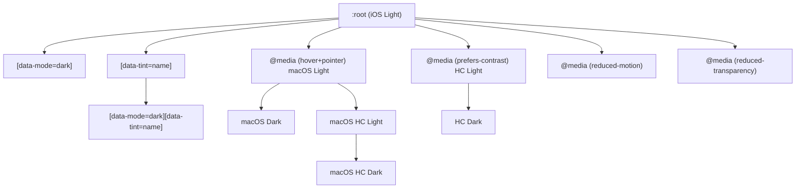
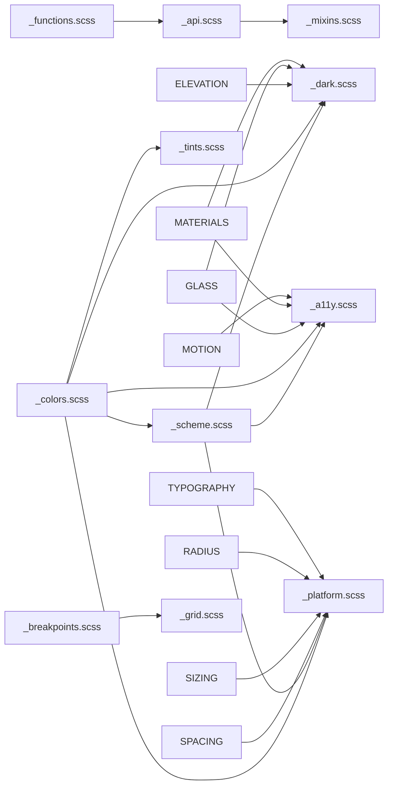

# @ngx-cupertino/tokens — Architecture

Design token system implementing the Apple Design System (iOS 26, iPadOS 26, macOS Tahoe 26) for web.

## File Tree

```
libs/tokens/src/lib/
├── _index.scss                 ← Entry point (cascade order)
│
├── ─── PRIMITIVES (7 files) ──────────────
├── _colors.scss                 18 tokens ← 12 accents + 6 grays
├── _typography.scss             27 tokens ← Fonts, type scale, weights
├── _spacing.scss                21 tokens ← 4px grid + semantic gaps
├── _sizing.scss                 27 tokens ← Targets, heights, dimensions
├── _radius.scss                 26 tokens ← Radius scale + semantic
├── _borders.scss                11 tokens ← Widths, colors, styles
├── _opacity.scss                 9 tokens ← States + overlays
│
├── ─── SEMANTIC (7 files) ────────────────
├── _scheme.scss                 28 tokens ← Labels, fills, bgs, separators
├── _tints.scss                4×13 preset ← Active accent [data-tint]
├── _elevation.scss               5 tokens ← Box shadows
├── _glass.scss                  17 tokens ← Liquid Glass (regular+clear)
├── _materials.scss              12 tokens ← System blur materials
├── _motion.scss                 10 tokens ← Durations + easing
├── _z-index.scss                 8 tokens ← Stacking order
│
├── ─── OVERRIDES (3 files) ───────────────
├── _dark.scss                  ~72 ovr    ← [data-mode="dark"]
├── _platform.scss             ~147 ovr    ← macOS (hover+pointer)
├── _a11y.scss                 ~115 ovr    ← HC, motion, transparency
│
├── ─── LAYOUT (3 files) ─────────────────
├── _breakpoints.scss          3 vars+6 mix ← Responsive queries
├── _grid.scss                  6 tokens   ← Columns, gutters, max-widths
├── _safe-areas.scss             7 tokens   ← Device insets
│
├── ─── UTILITIES (3 files) ──────────────
├── _api.scss                  ~236 map    ← Token validator + token()
├── _mixins.scss                21 mixins  ← Reusable patterns
└── _functions.scss              3 funcs   ← cup-rem, cup-space, cup-z
```

## 5-Layer Architecture

| Layer             | Files | Tokens          | What It Does                                          |
| ----------------- | ----- | --------------- | ----------------------------------------------------- |
| **1. Primitives** | 7     | ~139            | Raw values. "Here is red. Here is 16px."              |
| **2. Semantic**   | 7     | ~84 + tints     | Contextual meaning. "This is a label. This is glass." |
| **3. Overrides**  | 3     | 0 new, ~334 ovr | Dark mode, macOS, accessibility overrides             |
| **4. Layout**     | 3     | ~13 + 6 mix     | Responsive structure, grid, safe areas                |
| **5. Utilities**  | 3     | 0 tokens        | API: token(), mixins, functions — zero CSS output     |

## Cascade Order

The order in `lib/_index.scss` determines CSS specificity. Later files override earlier files.



## File Dependencies



## How Components Consume Tokens (3-Layer SCSS Pattern)

```scss
@use "@ngx-cupertino/tokens" as t;

// Layer 1 — token() for single values
:host {
    min-height: t.token("control-height");
    padding: t.token("padding-button");
    border-radius: t.token("radius-button");
    font-size: t.token("text-body");
}

// Layer 2 — mixins for multi-property patterns
:host {
    @include t.cup-interactive;
    @include t.cup-focus-ring;
}
:host(.filled) {
    background: t.token("tint");
    color: t.token("tint-on");
}
:host(.cup-disabled) {
    @include t.cup-disabled;
}
```

Components NEVER write raw `var(--cup-*)`. They always use `t.token('name')` for compile-time validation.

## Maintenance Rules

| Action                        | Update Required                                                             |
| ----------------------------- | --------------------------------------------------------------------------- |
| Add new `--cup-*` token       | Add entry to `$tokens` map in `_api.scss`                                   |
| Rename a token                | Update key in `$tokens` map. Old references fail to compile.                |
| Remove a token                | Remove from `$tokens` map. Components still referencing it fail to compile. |
| Change a token's VALUE        | No `_api.scss` change needed (map stores var() references)                  |
| Add dark/platform/HC override | No `_api.scss` change needed                                                |
| Add macOS-exclusive token     | Add entry to `$tokens` map                                                  |

## Platforms & Variants

- **Platforms**: iOS, iPadOS, macOS
- **Appearance variants**: Light, Dark, Light HC, Dark HC
- **Accessibility**: Increase Contrast, Reduce Motion, Reduce Transparency

## Semantic Typing & Color Space

- `@ngx-cupertino/core` owns the public `CupSemanticTokenName` union for semantic UI roles
- that union covers foreground, support, background, and separator families only
- palette, accent, material, and platform tokens stay out of the semantic union to avoid mixing raw values with role-based tokens
- token values default to sRGB; any Display P3 addition must be intentional, documented, and reviewed with extra visual QA
